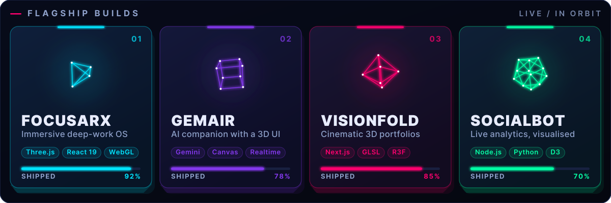
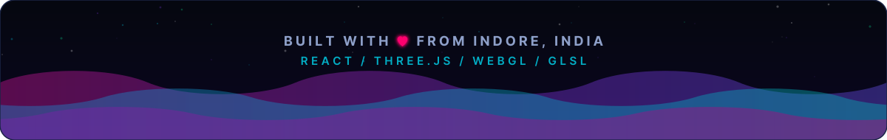

<div align="center">

<a href="https://rangwalaaliasgar55-bot.github.io/rangwalaaliasgar55-bot/">
  
</a>

<a href="https://rangwalaaliasgar55-bot.github.io/rangwalaaliasgar55-bot/">
  
</a>

<a href="https://github.com/rangwalaaliasgar55-bot"></a>
<a href="https://skyline.github.com/rangwalaaliasgar55-bot/2026"></a>
<a href="#-how-this-readme-is-made"></a>









<picture>
  <source media="(prefers-color-scheme: dark)" srcset="https://raw.githubusercontent.com/rangwalaaliasgar55-bot/rangwalaaliasgar55-bot/output/github-contribution-grid-snake-dark.svg" />
  <source media="(prefers-color-scheme: light)" srcset="https://raw.githubusercontent.com/rangwalaaliasgar55-bot/rangwalaaliasgar55-bot/output/github-contribution-grid-snake.svg" />
  
</picture>





</div>

<h2 align="center">🧊 How this README is made</h2>

<div align="center">
<a href="./web"></a>
</div>

<br/>

> Every graphic above is a **React component** rendered to a self-hosted animated SVG — no badge
> services, nothing that can 404, and real 3D baked in: `three.js` projects each rotating mesh
> through a perspective camera at build time and the frames ship as SMIL keyframes.
> The same `profile.ts` data also drives the live React Three Fiber site.

<table>
<tr>
<td width="50%" valign="top">

**`/web` — the live 3D site**

```bash
cd web
npm install
npm run dev      # React 19 + R3F + postprocessing
npm run check    # types → headless scene test → build
```

A scroll-driven camera flies down four levels: a distorting crystal, an orbiting
toolkit, one platonic solid per project, and a rippling cube field — with bloom,
a WebGL-less fallback and a headless smoke test so it can never ship blank.

</td>
<td width="50%" valign="top">

**`/assets` — the README artwork**

```bash
cd web
npm run assets       # render ../assets/*.svg
npm run assets:png   # + PNG previews for review
```

Text is compiled to vector outlines (no font downloads, identical on every
machine), icons come from Simple Icons, and GitHub Actions re-renders the set
whenever the data or components change.

</td>
</tr>
</table>

<div align="center">
<sub><b>React 19</b> · <b>Three.js</b> · <b>React Three Fiber</b> · <b>TypeScript</b> · <b>Vite</b> · <b>GitHub Actions</b></sub>
</div>
