  

  

  
  
  
  
  
  
  
  
  
  
  

  
  
  
  

---

## 🚀 What I'm building

| Project | What it is | Stack |
| --- | --- | --- |
| [**SocialBot**](https://github.com/rangwalaaliasgar55-bot/socialbot) | Open-source social media scheduling & automation bot — post, schedule, auto-engage and analyze 13+ platforms with background agents, AI content and a human review queue | Python, FastAPI, SQLite, vanilla-JS dashboard |
| [**FocusArx**](https://github.com/rangwalaaliasgar55-bot/focusarx) | AI-powered "Deep Work OS" — adaptive focus sessions, 3D gamification, real-time AI coaching | React 19, TypeScript, Three.js, Node.js, PostgreSQL |
| [**GemAir**](https://github.com/rangwalaaliasgar55-bot/GemAir) | Free, open-source, emotionally intelligent personal AI — a JARVIS-like companion with long-term memory | Electron, JavaScript |
| [**VisionFold Creative**](https://github.com/rangwalaaliasgar55-bot/VisionFoldCreative) | Cinematic studio platform — marketing site, client portal and studio CMS | Next.js 16, React 19, TypeScript, Tailwind 4 |

---

## 📊 Stats & activity

  
  
  

  

  

## 🗓️ Contribution skyline (3D)

  

---

## 🕐 India time (IST)

I build from Indore, Madhya Pradesh — **India Standard Time (UTC+5:30)**. Late-night commits are the norm. 🇮🇳

## 🧠 Focus areas

- Social media automation & growth bots (API-first, human-like pacing, safety-first by design)
- AI assistants with persistent memory and emotional intelligence
- Productivity tooling and deep-work software
- Cybersecurity — rate limits, blacklists and audit trails baked in by default

## 📫 Let's connect

- 🔗 [focusarx.site](https://focusarx.site)
- 💼 Open to collaboration on automation, AI products and solo-founder tooling
- 🤝 OSS always welcome: issues, feature ideas and PRs

 

  

